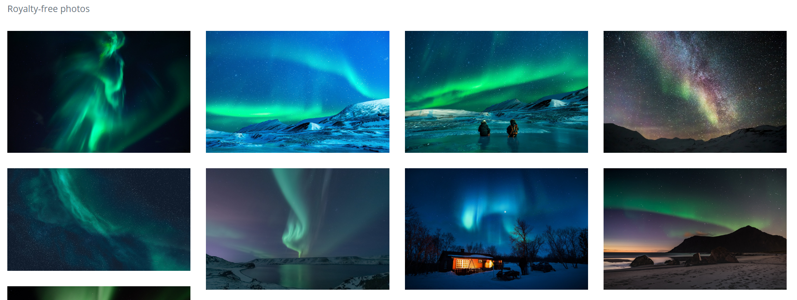

```{r setup, include=FALSE}
knitr::opts_chunk$set(echo=TRUE, message=FALSE, warning=FALSE, error=FALSE)
library(tidyverse)
photo_data <- read_csv("selected_photos.csv")
```

## Introduction

I chose the words "northern lights" for my search on Pixabay. I chose these words because I'm a big fan of night photography, especially of nice lights at night, and wanted something consistently aesthetically pleasing to analyse (and no one has ever accused any photo of the northern lights of not being beautiful).

Here is my screenshot:



I noticed that the photos tended to be of high quality/resolution, in landscape orientation, tended to have around 1k likes and hundreds of thousands of views, and tended to also be tagged "aurora" or "polar lights", and had lots of greens, blues, purples and blacks.

Here is my HTML table:
```{r introduction}
photo_data %>%
select(pageURL) %>%
knitr::kable()
```

Here is my GIF:


## Key features of selected photos

```{r key_features}
median_likes <- photo_data$likes %>% median(na.rm = TRUE)
sum_downloads <- photo_data$downloads %>% sum(na.rm = TRUE)
mean_views <- photo_data$views %>% mean(na.rm = TRUE)
grouped_summary <- photo_data %>% group_by(has_aurora_tag) %>% summarise(mean_views = mean(views))
a <- photo_data$previewURL[which.max(photo_data$likes)]

```

`r a` !!!!

The median number of likes on the selected photos was `r median_likes`.

The sum of the download on the selected photos was `r as.integer(sum_downloads)`.

The mean number of views on the selected photos was `r as.integer(mean_views)`.

The mean number of views for selected photos which did **not** have a tag with "aurora" in it was `r as.integer(grouped_summary$mean_views[1])`, while the mean number of views for those that did was `r as.integer(grouped_summary$mean_views[2])`.

## Creativity

I did two things to demonstrate creativity, because I didn't know if my first was creative enough. The first thing I did was create a scatter plot showing the correlation between downloads and likes in the photos:

```{r scatter}
ggplot(data=photo_data, aes(x=likes, y=downloads)) + geom_point()
```

This is creative because I actually think the correlation it shows is moderately interesting in terms of data analysis and could show that the two are directly linked (e.g. people who downloaded are more likely to like, or vice versa).

The second thing I did to demonstrate creativity was creating a second gif with only images of the same size. It bothered me that my_photos.gif changed sizes due to the photos varying in size, so I rigged up a way to determine the **mode** preview width of the original 200 images, then determine the mode height of those, and then generated a new gif with only images of that size. I reckon it looks nicer.

``` {r new_gif}
library(jsonlite)
library(magick)
json_data <- fromJSON("pixabay_data.json")
pixabay_photo_data <- json_data$hits

mode_width <- pixabay_photo_data %>%
  count(previewWidth, sort = TRUE) %>%
  slice(1) %>%
  pull(previewWidth)

mode_height <- pixabay_photo_data %>% 
  filter(previewWidth == mode_width) %>%
  count(previewHeight, sort = TRUE) %>%
  slice(1) %>%
  pull(previewHeight)

same_size_images <- pixabay_photo_data %>% filter(previewWidth == mode_width & previewHeight == mode_height)


img_urls <- same_size_images$previewURL %>% na.omit()
my_creative <- image_read(img_urls) %>%
  image_join() %>%
  image_scale(200) %>%
  image_animate(fps = 2)
my_creative
```


## Learning reflection

I learnt to summarise data in groups of categorical variables, which I think is a very interesting and useful thing to be able to do. It can show you differences in the summary values based on those categorical variables, which can hint towards the direction you should analyse next in terms of whether the categorical variable is dependent on other variables in the data.

I am curious to explore further the ways R can be used to mix with other languages and data formats. We've seen a mix of Markdown, R and JSON in this module, and are exploring SQL in the next. Being able to incorporate all of the separate data technology tools together in the ways we're exploring in this course is really handy and convenient.


## Appendix

```{r file='exploration.R', eval=FALSE, echo=TRUE}
library(tidyverse)
library(jsonlite)
library(magick)

# importing the "northern lights" photo data in json format
json_data <- fromJSON("pixabay_data.json")
pixabay_photo_data <- json_data$hits

# the three new variables i decided to generate were:
# has_aurora_tag - checks if the photo has a tag containing the word aurora
# num_tag_words - counts the number of words in the photo's tags
# url_length - counts the number of characters in the page url of the photo
selected_photos <- pixabay_photo_data %>%
  select(id, pageURL, previewURL, views, downloads, likes, tags) %>%
  mutate(has_aurora_tag = ifelse(str_detect(tags, "aurora"), "yes", "no"), 
         num_tag_words = str_count(tags, "\\S+") + 1,
         url_length = nchar(pageURL)) %>%
  filter(id <= min(id) + (median(id) - min(id))/2) 

write_csv(selected_photos, "selected_photos.csv")

# my three summary values, different for variety, self-explanatory variable names
median_likes <- selected_photos$likes %>% median(na.rm = TRUE)
sum_downloads <- selected_photos$downloads %>% sum(na.rm = TRUE)
mean_views <- selected_photos$views %>% mean(na.rm = TRUE)

# showing the mean views based on whether the photo has a tag with "aurora" in it
grouped_summary <- selected_photos %>% group_by(has_aurora_tag) %>% summarise(mean_views = mean(views))

# code adapted from lecture 3B to create gif
img_urls <- selected_photos$previewURL %>% na.omit()
image_read(img_urls) %>%
  image_join() %>%
  image_scale(200) %>%
  image_animate(fps = 2) %>%
  image_write("my_photos.gif")

# creativity section - creating a plot to show correlation between likes and downloads
ggplot(data=pixabay_photo_data, aes(x=likes, y=downloads)) + geom_point()


# creativity section - finding the mode preview width and then the mode height for that width
# in order to generate a gif with photos all of the same size
mode_width <- pixabay_photo_data %>%
  count(previewWidth, sort = TRUE) %>%
  slice(1) %>%
  pull(previewWidth)

mode_height <- pixabay_photo_data %>% 
  filter(previewWidth == mode_width) %>%
  count(previewHeight, sort = TRUE) %>%
  slice(1) %>%
  pull(previewHeight)

same_size_images <- pixabay_photo_data %>% filter(previewWidth == mode_width & previewHeight == mode_height)

# generating second gif
img_urls <- same_size_images$previewURL %>% na.omit()
image_read(img_urls) %>%
  image_join() %>%
  image_scale(200) %>%
  image_animate(fps = 2) %>%
  image_write("my_creative.gif")

```

